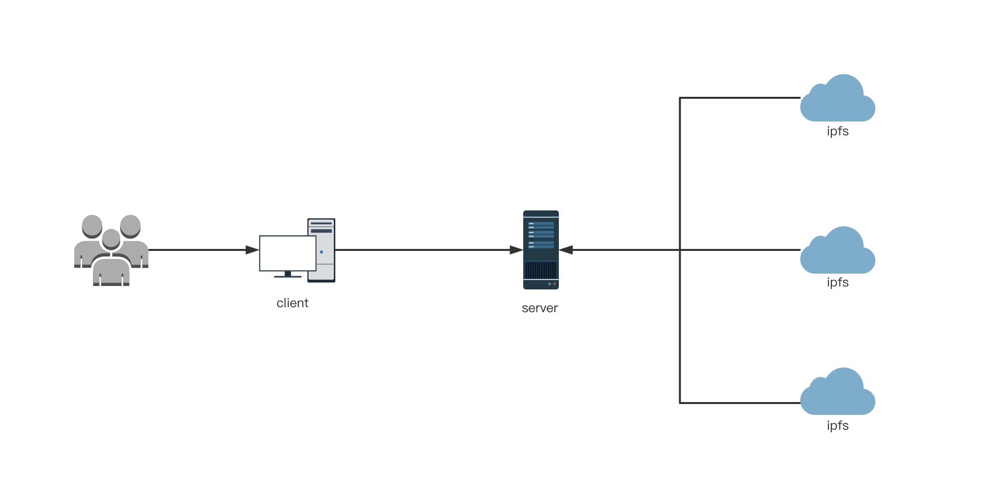

# SuperNova(超新星协议)

SuperNova是面向加密交易者和投资者的链上分析平台，将分析得出的历史数据，指标等信息存在IPFS中。前端使用React框架，后端使用Go，利用Python，geth等技术收集数据，同时将历史数据存在IPFS中。众所周知，数据是加密领域最宝贵的之源之一，掌握了数据，并加以正确分析，可以帮助用户判断。SuperNova可以将区块链上的地址都一一标记将信号与噪声区分开，数据使用IPFS存储。

## Architecture

+ 前端使用react开发Dapp应用入口服务
+ 后端使用Go,Python语言提供数据访问接口,数据来源通过geth爬取链上数据存储到ipfs

## Install

`yarn install`

## Dev

`yarn start`

## Build

`yarn build`

## Demo

[Demo: https://supernova-ipfs.netlify.app/](https://supernova-ipfs.netlify.app/)
